repositório do roteiro: https://github.com/AndreCorreaSantos/Roteiro1.git

## Roteiro 1

#### 1)

Intrusion detection systems (IDS) são ferramentas de segurança de internet usadas para monitorar tráfego e dispositivos contra atividades suspeitas e maliciosas envolvendo segurança da informação.

Exemplos de ferramentas que são utilizadas como IDS:

- ManageEngine Log360
- SolarWinds Security Event Manager

#### 2)

A principal diferença entre um serviço de IDS e IPS está no fato de que o IDS apenas monitora o tráfego e pode alertar o usuário contra ameaças, já o IPS chega a filtrar e impedir a passagem de pacotes caso o serviço os considere suspeitos. Ambos os serviços utilizam bases de dados com assinaturas conhecidas de ameaças digitais para cumprir suas respectivas funções.

## Desafio 1

### 3)

Utilizando Wireshark com display filter de "DHCP", podemos filtrar os pacotes e observamos quatro requests que pertencem ao protocolo DHCP:
3771    1819.721577    0.0.0.0    255.255.255.255    DHCP    344    DHCP Discover - Transaction ID 0xe50fe596
3772    1819.726860    10.0.19.1    10.0.19.14    DHCP    344    DHCP Offer    - Transaction ID 0xe50fe596
3773    1819.727280    0.0.0.0    255.255.255.255    DHCP    387    DHCP Request  - Transaction ID 0xe50fe596
3774    1819.731188    10.0.19.1    10.0.19.14    DHCP    349    DHCP ACK      - Transaction ID 0xe50fe596

Observa-se que esses quatro pacotes seguem uma lógica tradicional onde o computador manda um request no endereço de broadcast da rede para descobrir o servidor responsável por implementar o DHCP, em seguida o servidor responde com uma oferta, o cliente requisita o IP e, em seguida, o IP é associado ao PC.

Conclui-se que o servidor que implementa DHCP na rede capturada possui endereço 10.0.19.1.

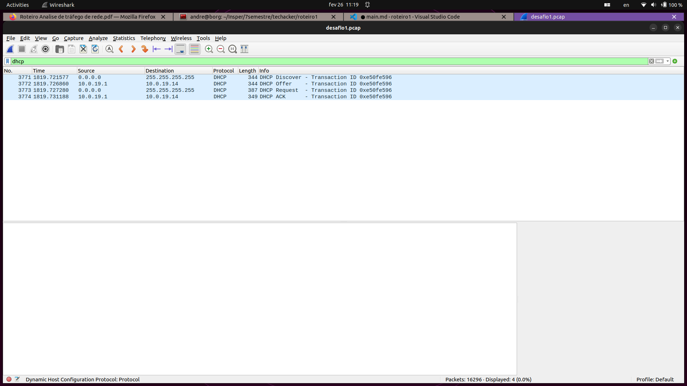

### 4)

A partir desse tutorial, https://unit42.paloaltonetworks.com/using-wireshark-identifying-hosts-and-users/, descobri que o controlador de domínio costuma utilizar o protocolo LDAP. Utilizando o display filter do Wireshark, filtrei os requests para apenas os que seguem o protocolo LDAP.

A grande maioria dos logs do protocolo LDAP que encontrei seguiam o seguinte padrão:

3481    839.331618    10.0.19.14    10.0.19.9    LDAP    203    SASL GSS-API Integrity: searchRequest(4) "CN=DESKTOP-5QS3D5D,CN=Computers,DC=burnincandle,DC=com" baseObject
3482    839.331994    10.0.19.9    10.0.19.14    LDAP    227    SASL GSS-API Integrity: searchResEntry(4) "CN=DESKTOP-5QS3D5D,CN=Computers,DC=burnincandle,DC=com" searchResDone(4) success  [4 results]

Ou seja, o cliente de número 10.0.19.14 inicia a conversa e requisita algo para o servidor de IP 10.0.19.9, que responde com um resultado. Assim, é possível concluir que o controlador de domínio dessa rede possui IP 10.0.19.9, com nome burnincandle.

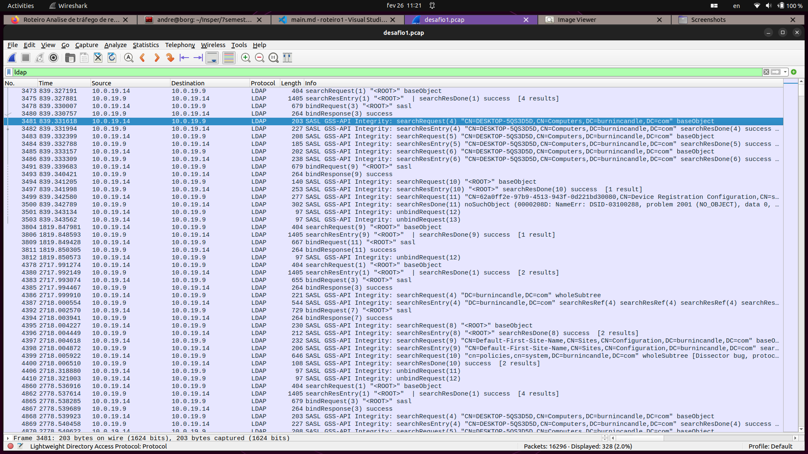

### 5)

Observando os requests, notei que o único computador que aparentava se comunicar com o domain controller era o computador de IP 10.0.19.14. Utilizando o display filter para filtrar todos os requests que chegam e saem do IP em questão e pertencem ao protocolo HTTP, notei que em certo momento essa máquina recebe um gzip.

498    24.690866    188.166.154.118    10.0.19.14    HTTP    678    HTTP/1.1 200 OK  (application/gzip)

Além disso, a maioria dos outros requests identificados com esse filtro são relacionados a Windows updates, fora outros dois:

9272    7555.029469    104.80.96.219    10.0.19.14    HTTP    317    HTTP/1.1 304 Not Modified

Esse primeiro que vai para x1.c.lencr.org, que parece suspeito em um primeiro momento, contudo, mediante pesquisa, aparenta ser algo natural: https://www.reddit.com/r/safing/comments/ra5t4jquestion_regarding_x1clencrorg_domain_found_in/.

4    0.186751    10.0.19.14    188.166.154.118    HTTP    365    GET / HTTP/1.1

Esse segundo request, entretanto, vai para o domínio [Full request URI: http://oceriesfornot.top/]. Pesquisando sobre esse domínio, é fácil encontrar sua relação à atividades maliciosas:
https://threatfox.abuse.ch/ioc/394377/.

Voltando ao primeiro request que recebia um gzip, nota-se que o host que enviou esse arquivo é o mesmo host malicioso do segundo request; dessa forma, podemos supor que o cliente instalou sem querer algum arquivo malicioso desse endereço e agora o malware instalou-se na máquina e está mandando informações do cliente via HTTP/GET para o host malicioso.

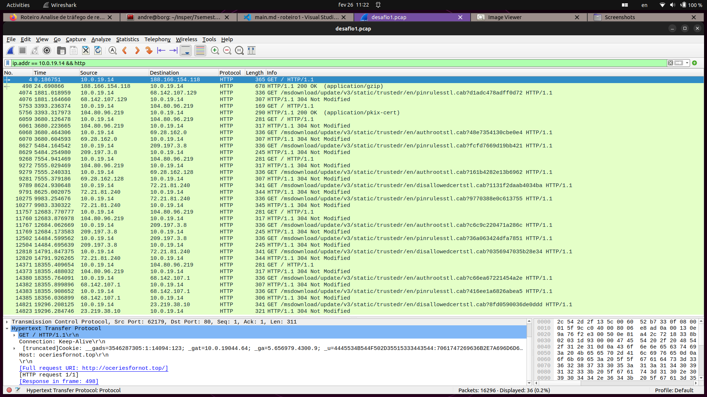

## Desafio 2

### 6)

Para encontrar o MAC address do host 192.168.2.4, primeiro tentei filtrar por requests do protocolo arp, entretanto não haviam requests desse protocolo nos logs. Em seguida filtrei por requests do protocolo dhcp e encontrei um DHCP ACK.

386	2.870163	192.168.2.4	192.168.2.147	DHCP	342	DHCP ACK      - Transaction ID 0x1b434a16

no aba de Source do nível de Ethernet II do request foi possível identificar o MAC address da máquina em questão:
Address: Dell_96:d2:c8 (90:b1:1c:96:d2:c8)--> MAC =  90:b1:1c:96:d2:c8.

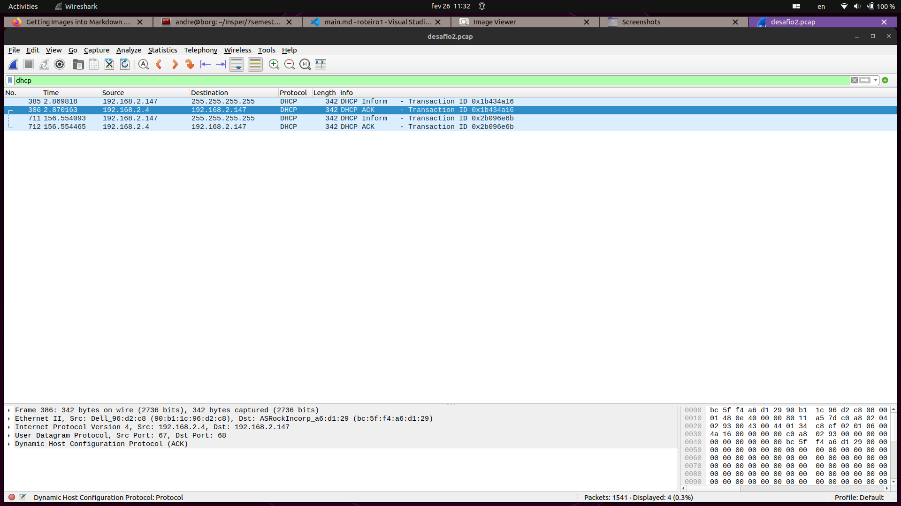

### 7)

Para encontrar o hostname associado ao IP 192.168.2.147 utilizei o display filter com o filtro: kerberos.msg_type==13 && ip.addr == 192.168.2.147, para filtrar somente requests do tipo TGS-REP enviados para o ip de interesse. Com esse filtro ao investigar a variável cname de um dos requests, encontrei o nome do host associado ao IP.
LYAKH-WIN7-PC$

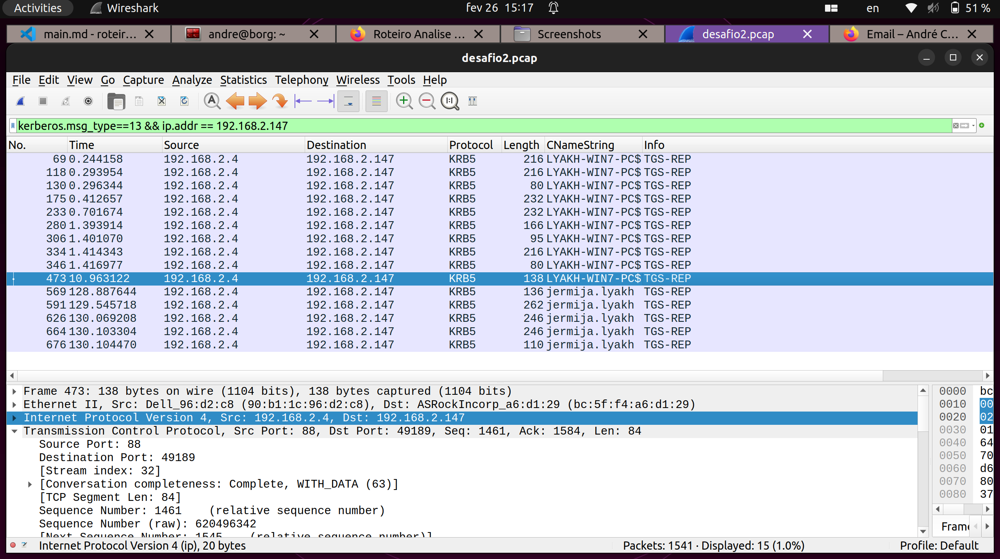

### 8)

Filtrando os requests pelo protocolo kerberos, reparei que existem quatro principais tipos de requests: AS-REQ, AS-REP, TGS-REQ e TGS-REP.
pesquisando um pouco descobri que essas são etapas normais de autenticação por meio do kerberos. As etapas AS tem a ver com a conversa inicial entre o usuário e o servidor de autenticação e as etapas TGS tem a ver com a requisição de um ticket por parte do usuário e a resposta do servidor com o ticket do usuário. Em especial na etapa TGS-REP o servidor devolve um ticket para o usuário e nessa resposta, sob a variável cname - client name, é possível encontrar o nome do usuário windows em questão - essa mesma lógica foi utilizada na questão anterior.

CNameString: jermija.lyakh

para encontrar os requests do tipo TGS-REP, utilizei o display filter: kerberos.msg_type==13 && ip.addr == 192.168.2.147.

O filtro utilizado foi o mesmo da questão anterior.

### 9)

Kerberos é um protocolo de autenticação em redes de computadores baseado em tickets que permite que nós se comuniquem sobre uma rede não segura e comprovem sua identidade um ao outro de maneira segura. O protocolo foi desenvolvido pelo MIT e utiliza criptografia simétrica para autenticar usuários e serviços, evitando que senhas sejam enviadas sem criptografia pela rede.

### 10)

Filtrando os logs por "http" no display filter, encontram-se poucos http requests. Observando-os nota-se o último request apresenta uma URI de destino na qual há a requisição de um recurso com extensão .exe - que é um arquivo executável windows.

[Request URI: http://micropcsystem.com/hojuks/vez.exe]

A url responsável pelo arquivo é: http://micropcsystem.com/hojuks/vez.exe e o nome do arquivo é: "vez.exe".

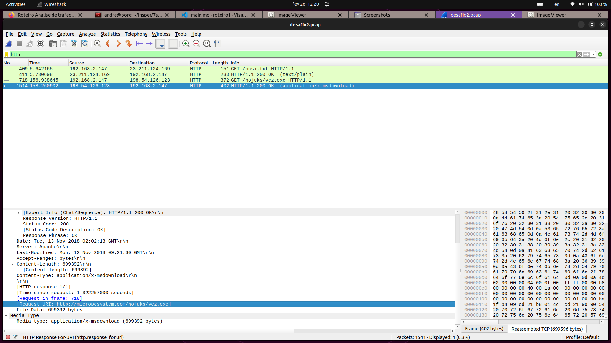

### 11)

Investigando o request da questão anterior, podemos encontrar a data e horário na Sessão "Hypertext Transfer Protocol":

Date: Tue, 13 Nov 2018 02:02:13 GMT\r\n

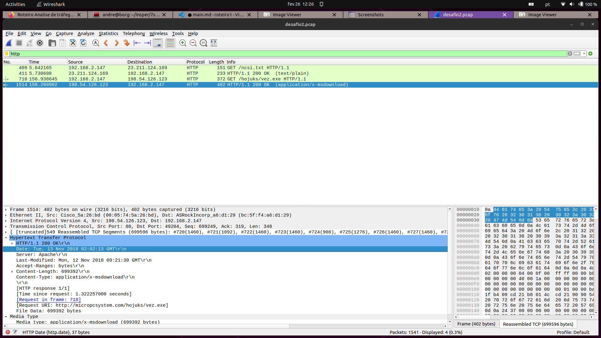

### 12)

Após receber o executável a máquina contaminada tenta estabelecer uma conexão TCP com 93.87.38.24, enviando um SYN para esse endereço.

1526	169.794964	192.168.2.147	93.87.38.24	TCP	66	49205 → 3369 [SYN] Seq=0 Win=8192 Len=0 MSS=1460 WS=256 SACK_PERM

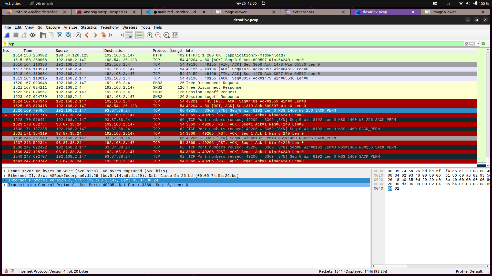

## Desafio 3

### 13)

Filtrando os requests para apenas protocolo dhcp e ip.addr == 172.17.1.129, ao inspecionar um request que tem origem no ip de interesse é possível encontrar o MAC address na camada ETHERNET II do pacote.

Source: Intel_4a:d7:5c (00:1e:67:4a:d7:5c)--> MAC = 00:1e:67:4a:d7:5c

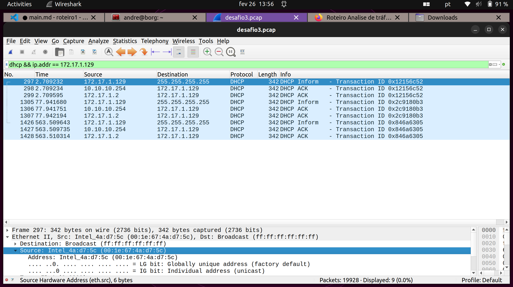

### 14)

Utilizando uma lógica similar à questão 8, filtrei os requests: kerberos.msg_type == 13 && ip.dst == 172.17.1.129 , de modo a visualizar apenas pacotes do tipo TGS-REP enviados para o IP de interesse. Inspecionando um dos requests encontrados, é possível encontrar o nome do usuário associado ao IP sob o campo Cname.

CNameString: NALYVAIKO-PC$  
Nome do usuário: NALYVAIKO-PC$

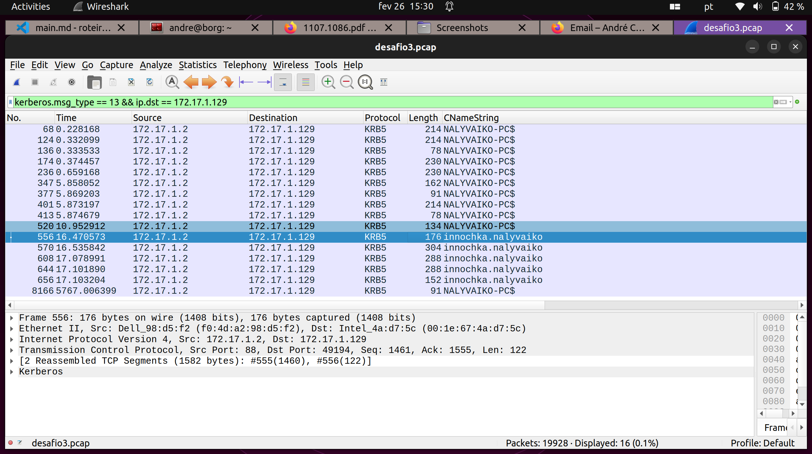

### 15)

Utilizando o mesmo filtro da conta anterior, inspecionando alguns requests abaixo podemos encontrar o nome da conta de usuário do windows no ip de interesse:

nome: innochka.nalyvaiko

### 16)

Filtrando os logs para apenas requests relacionados ao ip de interesse, no protocolo http  e com content_type igual a application/msword, foi possível encontrar o request em que o url que retornou um documento word.
http://ifcingenieria.cl/QpX8It/BIZ/Firmenkunden/

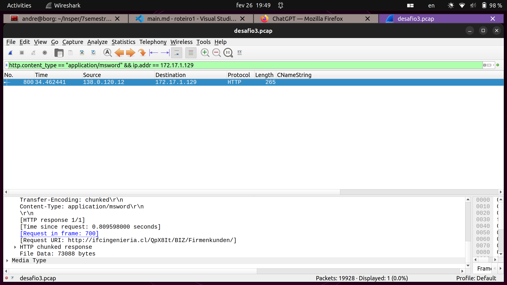

### 17)

Podemos ver a data e hora em que a URL foi criada no campo Last-Modified da sessão Hypertext Transfer Protocol.

Last-Modified: Mon, 12 Nov 2018 21:01:49 GMT

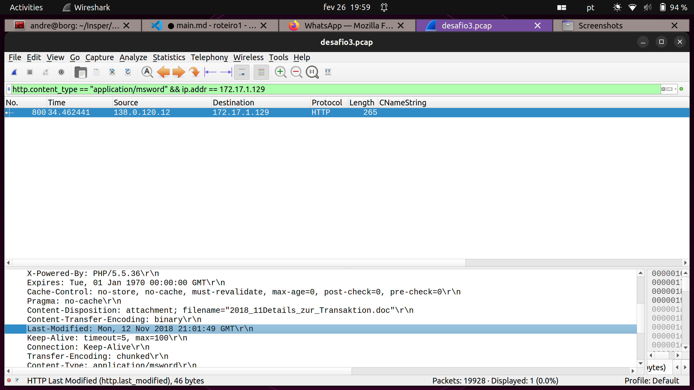

### 18)

Filtrando todos requests http que contém .exe foi possível encontrar um request no qual o ip de interesse tenta baixar um arquivo executável.

URI: http://timlinger.com/nmw/

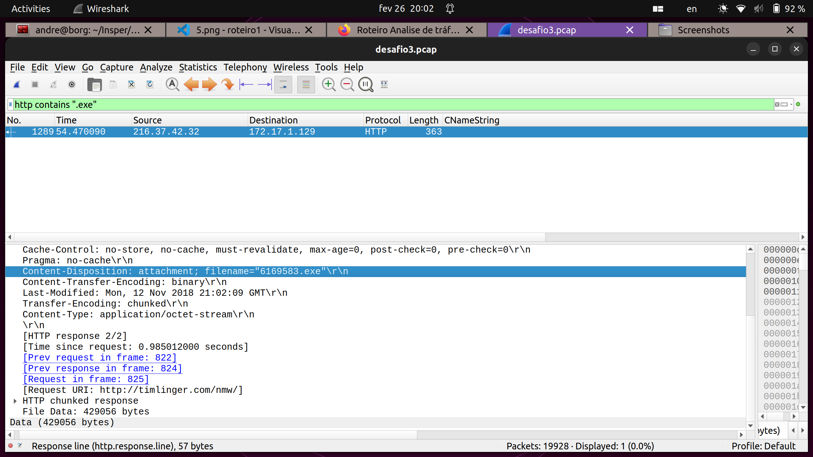

### 19)

Inspecionando os requests do protocolo kerberos, é possível observar que o ip
192.168.1.216 envia pedidos para 192.168.1.2 requisitando algo e o servidor responde com um ticket. A partir disso, é possível concluir que o ip do domain controller é 192.168.1.2.

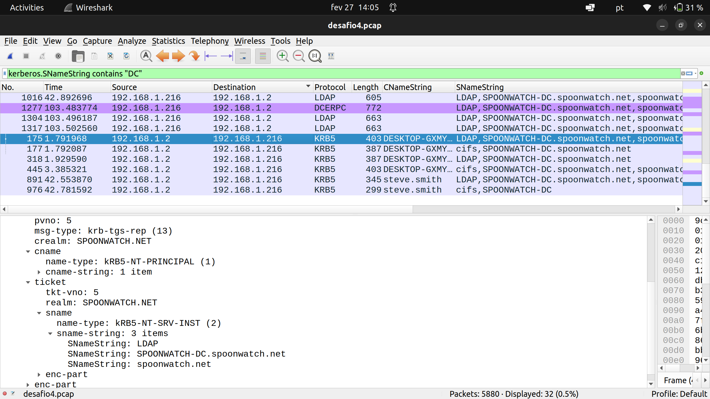

### 20)

Observando o cname String do pedido de ticket do  protocolo kerberos, é possível encontrar o nome do usuário associado ao ip de interesse.

User account: steve.smith

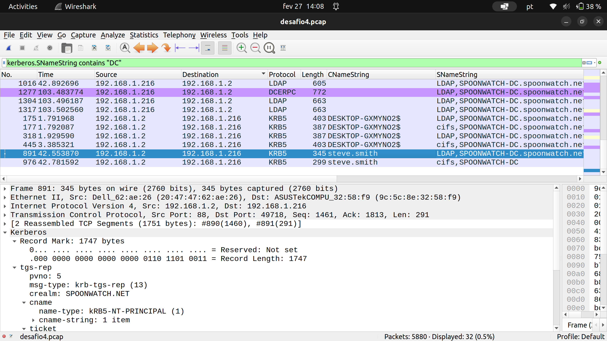

### 21)

O hostname é DESKTOP-GXMYNO2$, obtido via sname do protocolo kerberos, TGS-REP.

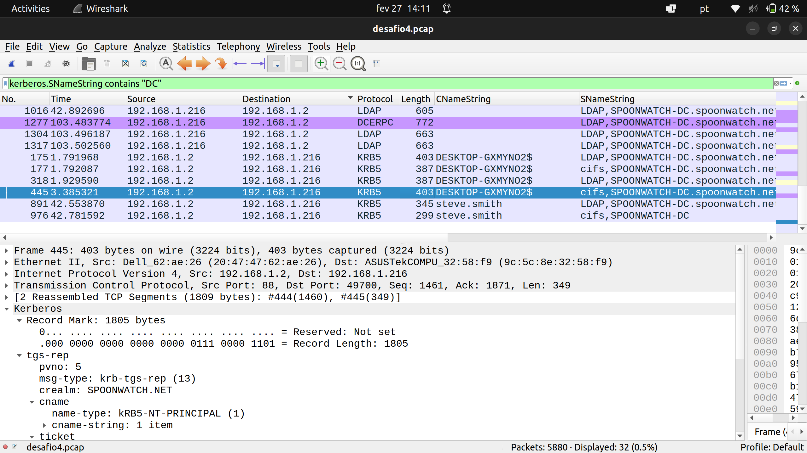

### 22)

Filtrando os requests por http e apenas aqueles que contém zip, podemos encontrar uma série de requests no qual o host de interesse envia jpgs para um host externo.

Ip contaminado: 192.168.1.216
Ip suspeito: 2.56.57.108

o endereço suspeito para o qual o host envia os arquivos é: http://2.56.57.108/osk//main.php

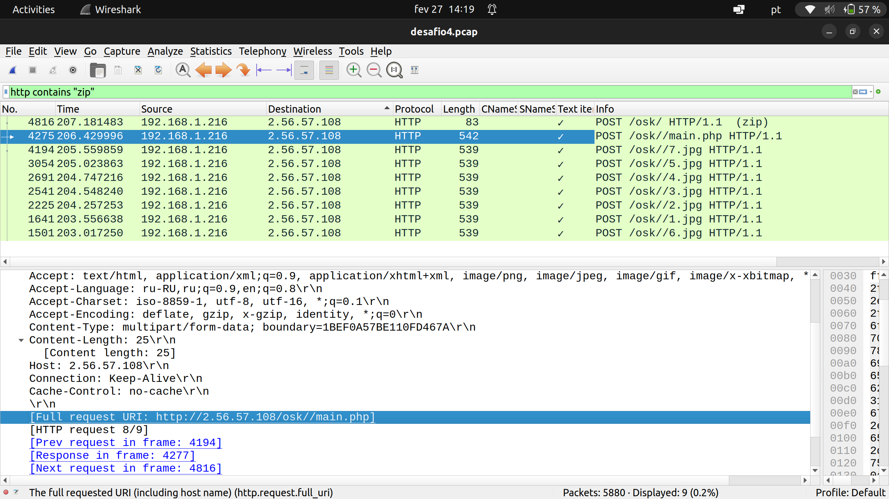

### 23)

O request sai da porta 49738 (src port do request) do ip contaminado (192.168.1.216) e vai para a porta 80 do ip suspeito (dst port do request).

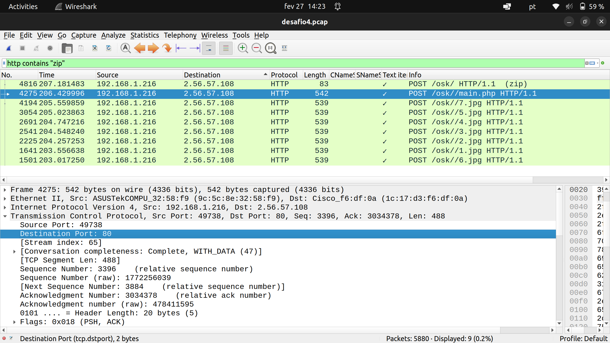
